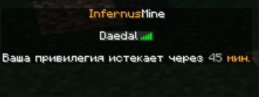

# Expansion-ExpiryTime

ExpiryTime - это дополнение для плагина [PlaceholderAPI](http://placeholderapi.com/), которое изменяет отображение времени до истечения привилегии в LuckPerms

## Особенности
Дополнение не отображает никаких лишних неделей, месяцев и секунд. Никаких "До истечения Вашей привилегии осталось 16 месяцев, 1 неделя, 5 дней, 1 час, 10 минут и 30 секунд.
Игрок задаётся вопросом - зачем мне знать сколько минут и секунд осталось до истечения моей привилегии, если это произойдёт через полтора года? 

> ***Легко и быстро. Твёрдо и чётко.***

Только количество дней, и отображение деталей только при их необходимости - когда срок привилегии уже подходит к концу.

## Установка:
- Скачать из раздела Releases, после чего закинуть в директорию /путь/до/сервера/plugins/PlaceholderAPI/expansions
- Выполнить команду /papi reload
- Проверить работу с помощью /papi parse me %expiry_группа% . Где 'группа' - там должно быть любое название группы, которую имеет Ваш аккаунт. При успешном выполнении можно продолжать работу

## Использование:
> **%expirytime_группа%**

**Примеры:**
> **%expirytime_koldun%**

> **%expirytime_zenturion%**

> **%expirytime_commander%**

## Механизм работы:
- Проверка существования указанной группы на сервере. В случае ее отсутствия дополнение напишет НЕИЗВЕСТНАЯ ГРУППА вместо нужного вывода.
- Поиск указанной группы у игрока в списке его групп. Если игрок не наследует данную игроку, плагин вернет запрос, который Вы пытались исполнить в формате %expiry_группа%
- Если группа найдена, осуществляется проверка на истекаемость срока наследования. Если срок наследования группы не истекает (добавлена не с помощью -temp-команд, а add или set), вместо времени выведется знак бесконечности.
- Если срок наследования истекает, то плагин смотрит, осталось ли до момента окончания больше одного дня. В таком случае ожидаемый вывод будет таков:

>- 365 д.
>- 30 д.
>- 7 д.

5. Если же наследование группы истекает меньше чем через 1 день, то плагин сперва смотрит, осталось ли до истечения больше 1-го часа, если да, то ожидаемый вывод будет таков:

>- 23 ч.
>- 13 ч.
>- 3 ч.

6. Если же наследование группы истекает меньше чем через 1 час, то будут выведены минуты до окончания срока наследования группы, тогда ожидаемый вывод будет таков:

>- 59 мин.
>- 10 мин.
>- 5 мин.

## Конфигурация

Конфигурационный файл находится по пути /путь/до/сервера/plugins/PlaceholderAPI/config.yml в секции expirytime.

Дефолтная конфигурация:

```yml
  expirytime:
    invalid_group: '&cНЕИЗВЕСТНАЯ ГРУППА' # Цвет и написание случая, когда группа не найдена в LuckPerms
    never: '&6∞' # Цвет и написание случая, когда привилегия не заканчивается
    hours: '&6 ч.' # Цвет и написение количества часов.
    minutes: '&6 мин.' # Цвет и написание количества минут.
    days: '&6 дн.' # Цвет и написание количества дней.
    numbers_color: '&7' # Цвет чисел, находящихся перед количеством дней/часов/минут
```

## Примеры



